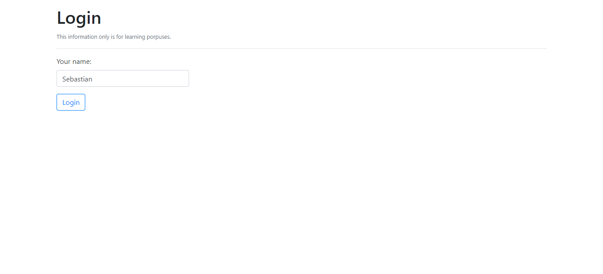
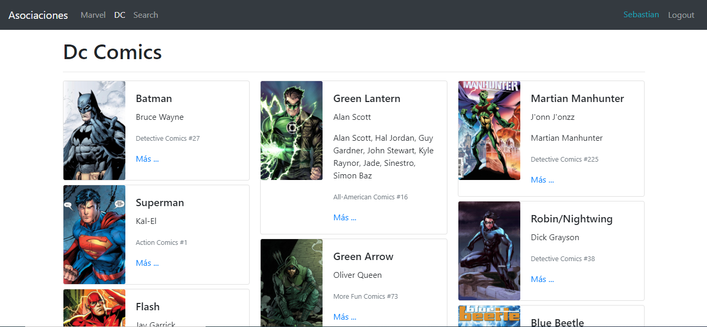

# Hero App - React

A simple aplication with React and react-router-dom, with Private Routes and Public routes for
user has no authenticated.

**Features**

- User Authentication (Fake Auth)
- Protected routes
- Public routes
- Go back to last path after logout
- Different layouts for different Routers

## Install and run

To install only run ```npm install``` to download all the dependencies, once finished run ```npm start``` and go to [http://localhost:3000](http://localhost:3000).


## Screenshots

Login Screen.


Dashboard Screen.


